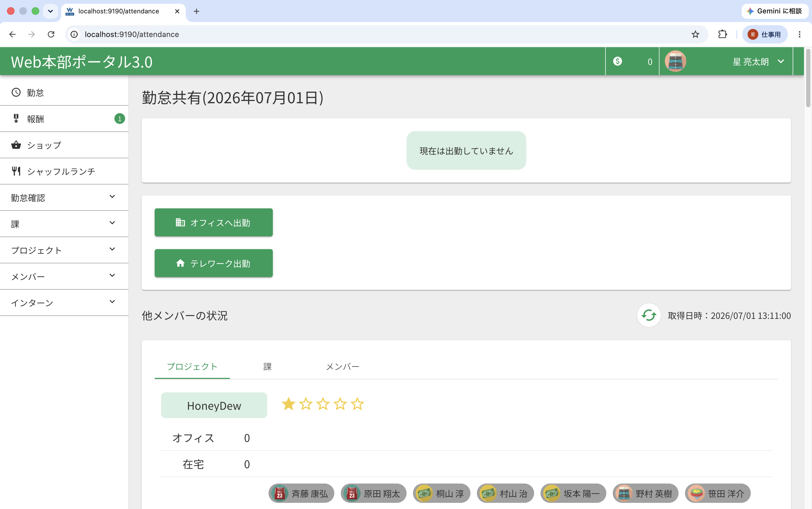

# 環境構築の手順

## 前提

### Windows

- Docker Desktop for Windowsが利用可能になっている
- WSL2 + Ubuntuのセットアップが完了している
  - 参考）[WSL2 + Ubuntuのセットアップ](./document/WSL2.md)
- hostsファイルに ```127.0.0.1 localhost```のような記載があり、localhostでアクセスが可能になっている

### Mac

- Docker Desktop for Mac が利用可能になっている
- hostsファイルに ```127.0.0.1 localhost```のような記載があり、localhostでアクセスが可能になっている

## 注意事項
- 以降の構築手順はエディター内のターミナルタブ、Windowsターミナルなどどこから実施してもOKです
- dockerディレクトリ以下に```CRLF```ファイルがあるとビルドに失敗します
- CTRL+選択した状態でCTRL+SHIFT+Aでアクションを実施→```LF - Unix and MacOS```を実施すると一括でLFに変更できます
- インストール時の権限でファイル所有者がrootなどになっていると正常に動作しない場合があるので、その場合はchownで対応してください
    - 例）`sudo chown {name}:{group} -R {target_dir}`

## 環境構築

### リポジトリをcloneする

1. 任意の場所にディレクトリを作成する
  - 例 `/home/user-name/workspace/wportal2`
2. 上記のディレクトリをエディターで開く
3. 本リポジトリをcloneする

### .envファイルを用意する

1. 以下のコマンドを実行する

```
cd wportal2-app
cp .env.local.sample .env
```

2. Backlogのwiki[[接続情報]]に記載の以下の環境変数を設定する

```
GOOGLE_CLIENT_ID=<YOUR_GOOGLE_CLIENT_ID>
GOOGLE_CLIENT_SECRET=<YOUR_GOOGLE_CLIENT_SECRET>
```

### コンテナを起動する

```
cd ..
docker-compose build
docker-compose up -d
```

### composerとnpmをインストールする

```
docker exec -it wportal2_web bash
> composer install
> npm ci
```

### データベースを初期化する

```
## 初めて初期化する場合
> php artisan migrate

## 再度初期化する場合
> php artisan migrate:refresh
```

### ログファイルの権限を修正する

- コンテナから抜け出してUbuntu上などのターミナルで実行する
- /wportal2-appの直下で実行する

```
sudo chmod -R 777 storage/
```

### minioの設定

1. http://localhost:19001/login へアクセスする
2. `.env`に記載の以下の情報でログインする

```
WPORTAL_STORAGE_ACCESS_KEY=
WPORTAL_STORAGE_SECRET_KEY=
```

3. http://localhost:19001/buckets へアクセスする
4. `Create Bucket +`のボタンをクリックする
5. `Bucket Name`に`.env`に記載の以下の情報を入力する

```
WPORTAL_STORAGE_BUCKET=
```

6. `Create Bucket`のボタンをクリックする

### 初期データを投入する

```
docker exec -it wportal2_web bash
> php artisan db:seed --class=TestCaseSeeder
```

### 環境構築後の動作確認

1. 以下のコマンドを実行する

```
docker exec -it wportal2_web bash
> npm run dev
```

2. [http://localhost:9190](http://localhost:9190)へアクセスする
3. Googleアカウントで認証する
4. [http://localhost:9190/attendance](http://localhost:9190/attendance)へアクセスする
5. 以下のような画面が表示されることを確認する<br/>※「他メンバーの状況」に表示される情報が異なっても問題ありません

<div align="center"></div>

## precommitの設定

### precommitを設定する

- コンテナから抜け出してUbuntu上などのターミナルで実行する
- /wportal2-appの直下で実行する

```
(> exit)
npm run prepare
```

### コミット時の動作確認

1. 任意のブランチを作成する
2. `wportal2-app/resources/script/Pages/MvcValue/MvcValue.tsx`に動作確認のコードを追加する

```
const i = 0;
```

3. 下記のコマンドを実施する

```
git add .
docker exec -it wportal2_web bash
> npm run lefthook
```

4. 以下のようなエラー表示がされてコミットができないことを確認する

```
/var/www/html/wportal2-app/resources/script/Pages/MvcValue/MvcValue.tsx
  10:9  error  'i' is assigned a value but never used  @typescript-eslint/no-unused-vars

✖ 1 problem (1 error, 0 warnings)
```

## 付録

- [利用パッケージについて](document/PACKAGE.md)
- [Laravel/Inertiaの基本的な導線とページ作成ガイド](./document/PAGE_CREATION_GUIDE.md)
- [推奨するEnumの利用・自動出力について](./document/ENUM_EXPORT.md)
- [レスポンシブ対応（mediaQuery)について](document/MEDIA_QUERY.md)
- [GraphQLの利用方法について](./document/GRAPHQL.md)
- [バリデーション（フロント/サーバー）について](./document/VALIDATION.md)
- [SPAビルドについて](./document/SPA.md)
- [InertiaLinkとPartialLoadについて](./document/INERTIA_LINK_AND_PARTIAL_LOAD.md)
- [TIPS](./document/TIPS.md)
- [テスト実行ガイド（VS Code: チャット/フラスコ対応）](./document/TESTING.md)
