# ER図（テーブル間リレーション）

```mermaid
erDiagram
    %% ===== 認証・ユーザー基盤 =====
    auth_user {
        bigint id PK
        string name
        string email UK
        timestamp email_verified_at
        string password
        string google_id
        string remember_token
        int e_enable_legacy_login
        string onetime_password
        datetime onetime_password_expired
        int e_enable_sp_login
        string sp_password
        string sp_google_2fa_secret
        int sp_login_failed_count
        int e_archive_level
        timestamps created_at
        timestamps updated_at
    }

    trn_user {
        bigint id PK
        int auth_id FK
        string nickname
        int current_gold
        int accumulation_gold
        date birth_date
        text self_introduction
        string face_image_path
        int e_archive_level
        timestamps created_at
        timestamps updated_at
    }

    trn_user_slack_profile {
        bigint id PK
        int trn_user_id FK
        string slack_user_id
        string slack_user_name
        string slack_team_id
        int e_archive_level
        timestamps created_at
        timestamps updated_at
    }

    trn_user_authority {
        bigint id PK
        int trn_user_id FK
        int e_user_authority
        int e_archive_level
        timestamps created_at
        timestamps updated_at
    }

    trn_attendance_state {
        bigint id PK
        int trn_user_id FK
        int e_attendance_state
        int e_archive_level
        timestamps created_at
        timestamps updated_at
    }

    %% ===== 部署・プロジェクト =====
    trn_division {
        bigint id PK
        string name
        text explain
        int display_order
        int e_archive_level
        timestamps created_at
        timestamps updated_at
    }

    trn_division_user {
        bigint id PK
        int trn_division_id FK
        int trn_user_id FK
        int e_archive_level
        timestamps created_at
        timestamps updated_at
    }

    trn_project {
        bigint id PK
        string name
        text explain
        int display_order
        int e_archive_level
        timestamps created_at
        timestamps updated_at
    }

    trn_project_user {
        bigint id PK
        int trn_project_id FK
        int trn_user_id FK
        int e_archive_level
        timestamps created_at
        timestamps updated_at
    }

    trn_project_notification {
        bigint id PK
        int trn_project_id FK
        int notification_type
        string notification_value
        int e_archive_level
        timestamps created_at
        timestamps updated_at
    }

    trn_user_project_priority {
        bigint id PK
        int trn_user_id FK
        int trn_project_id FK
        int project_priority
        int e_archive_level
        timestamps created_at
        timestamps updated_at
    }

    trn_user_division_priority {
        bigint id PK
        int trn_user_id FK
        int trn_division_id FK
        int division_priority
        int e_archive_level
        timestamps created_at
        timestamps updated_at
    }

    %% ===== リワード・ショップ =====
    mst_reward {
        bigint id PK
        int reward_kind
        int reward_rank
        string reward_name
        string reward_explain
        int reward_gold
        int e_enable_repeat
        int e_archive_level
        timestamps created_at
        timestamps updated_at
    }

    trn_user_reward {
        bigint id PK
        int trn_user_id FK
        int mst_reward_id FK
        int achievement_count
        int received_count
        datetime achieved_at
        datetime received_at
        int e_archive_level
        timestamps created_at
        timestamps updated_at
    }

    mst_goods {
        bigint id PK
        string name
        string explain
        string comment
        int category
        string image_path
        string author_email
        int price
        int e_archive_level
        timestamps created_at
        timestamps updated_at
    }

    trn_shop_aggregate {
        bigint id PK
        int mst_goods_id FK
        int trn_user_id FK
        int e_archive_level
        timestamps created_at
        timestamps updated_at
    }

    %% ===== シャッフルランチ =====
    trn_shuffle_lunch_entry {
        bigint id PK
        int trn_user_id FK
        date event_date
        int event_time_zone
        int e_archive_level
        timestamps created_at
        timestamps updated_at
    }

    trn_shuffle_lunch_group {
        bigint id PK
        date event_date
        int event_time_zone
        int group_id
        int trn_user_id FK
        int rakumo_blocked
        int e_archive_level
        timestamps created_at
        timestamps updated_at
    }

    %% ===== GoodJob =====
    trn_good_job {
        bigint id PK
        int trn_user_id FK
        int from_target_type
        int from_trn_user_id FK
        int from_trn_division_id FK
        int from_trn_project_id FK
        string from_other_label
        int to_target_type
        int to_trn_user_id FK
        int to_trn_division_id FK
        int to_trn_project_id FK
        string to_other_label
        string title
        text content
        int e_archive_level
        timestamps created_at
        timestamps updated_at
    }

    %% ===== 座席管理 =====
    trn_seat {
        bigint id PK
        string label
        int position_x
        int position_y
        string phone_number
        int e_archive_level
        timestamps created_at
        timestamps updated_at
    }

    %% ===== バッチ履歴 =====
    trn_batch_release_history {
        bigint id PK
        string batch_identify UK
        int execution_count
        int e_archive_level
        timestamps created_at
        timestamps updated_at
    }

    %% ===== リレーション =====
    auth_user ||--o| trn_user : "1:1 auth_id"
    trn_user ||--o| trn_user_slack_profile : "1:1 trn_user_id"
    trn_user ||--o{ trn_user_authority : "1:N trn_user_id"
    trn_user ||--o{ trn_attendance_state : "1:N trn_user_id"

    trn_division ||--o{ trn_division_user : "1:N trn_division_id"
    trn_user ||--o{ trn_division_user : "1:N trn_user_id"

    trn_project ||--o{ trn_project_user : "1:N trn_project_id"
    trn_user ||--o{ trn_project_user : "1:N trn_user_id"

    trn_project ||--o{ trn_project_notification : "1:N trn_project_id"

    trn_user ||--o{ trn_user_project_priority : "1:N trn_user_id"
    trn_project ||--o{ trn_user_project_priority : "1:N trn_project_id"

    trn_user ||--o{ trn_user_division_priority : "1:N trn_user_id"
    trn_division ||--o{ trn_user_division_priority : "1:N trn_division_id"

    trn_user ||--o{ trn_user_reward : "1:N trn_user_id"
    mst_reward ||--o{ trn_user_reward : "1:N mst_reward_id"

    trn_user ||--o{ trn_shop_aggregate : "1:N trn_user_id"
    mst_goods ||--o{ trn_shop_aggregate : "1:N mst_goods_id"

    trn_user ||--o{ trn_shuffle_lunch_entry : "1:N trn_user_id"
    trn_user ||--o{ trn_shuffle_lunch_group : "1:N trn_user_id"

    trn_user ||--o{ trn_good_job : "1:N trn_user_id (作成者)"
    trn_user ||--o{ trn_good_job : "1:N from/to_trn_user_id"
    trn_division ||--o{ trn_good_job : "1:N from/to_trn_division_id"
    trn_project ||--o{ trn_good_job : "1:N from/to_trn_project_id"
```

## リレーション要約

| 関係 | 種別 | 接続キー |
| :--- | :--- | :--- |
| `auth_user` → `trn_user` | 1:1 | `auth_id` |
| `trn_user` → `trn_user_slack_profile` | 1:1 | `trn_user_id` |
| `trn_user` → `trn_user_authority` | 1:N | `trn_user_id` |
| `trn_user` → `trn_attendance_state` | 1:N | `trn_user_id` |
| `trn_division` ↔ `trn_user` (via `trn_division_user`) | N:N | 中間テーブル |
| `trn_project` ↔ `trn_user` (via `trn_project_user`) | N:N | 中間テーブル |
| `trn_project` → `trn_project_notification` | 1:N | `trn_project_id` |
| `trn_user` + `trn_project` → `trn_user_project_priority` | N:N (優先度付き) | 複合参照 |
| `trn_user` + `trn_division` → `trn_user_division_priority` | N:N (優先度付き) | 複合参照 |
| `trn_user` + `mst_reward` → `trn_user_reward` | N:N (実績付き) | 複合参照 |
| `trn_user` + `mst_goods` → `trn_shop_aggregate` | N:N (購入履歴) | 複合参照 |
| `trn_user` → `trn_shuffle_lunch_entry` | 1:N | `trn_user_id` |
| `trn_user` → `trn_shuffle_lunch_group` | 1:N | `trn_user_id` |
| `trn_good_job` → `trn_user` / `trn_division` / `trn_project` | 多方向参照 | from/to各ID |
| `trn_seat` | 独立 | なし |
| `trn_batch_release_history` | 独立 | なし |
